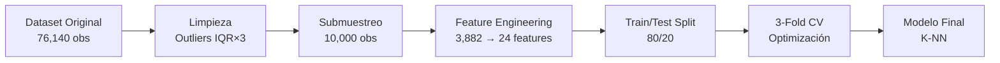

<div align="center">

# 🚗 Predicción de Congestión Vehicular en Santiago

### 🏆 Proyecto Ganador - Olimpiadas de Minería de Datos 2025
**Universidad Andrés Bello | Ingeniería Civil Informática**

[](https://zapallo.shinyapps.io/congestion-santiago-v2/)
[](https://www.r-project.org/)
[]()
[]()

<br>

**Sistema de Machine Learning que predice la duración de congestión vehicular en Santiago de Chile con un error promedio de ~31 minutos, utilizando datos geoespaciales y de infraestructura vial.**

[🚀 Ver Demo en Vivo](https://zapallo.shinyapps.io/congestion-santiago-v2/) • [📊 Resultados](#-resultados) • [🛠️ Tecnologías](#️-stack-tecnológico)

</div>

---

## 📋 Tabla de Contenidos

- [El Problema](#-el-problema)
- [La Solución](#-la-solución)
- [Resultados](#-resultados)
- [Demo Interactivo](#-demo-interactivo)
- [Metodología](#-metodología)
- [Stack Tecnológico](#️-stack-tecnológico)
- [Estructura del Proyecto](#-estructura-del-proyecto)
- [Instalación y Uso](#-instalación-y-uso)
- [Autor](#-autor)

---

## 🎯 El Problema

<table>
<tr>
<td width="60%">

### Contexto

La **congestión vehicular en Santiago** es uno de los principales desafíos de movilidad urbana en Chile. Con millones de vehículos circulando diariamente, los conductores y autoridades necesitan herramientas predictivas que les permitan:

- ⏱️ Estimar tiempos de viaje con precisión
- 🛣️ Planificar rutas alternativas
- 🏛️ Tomar decisiones de infraestructura basadas en datos

### El Desafío

¿Es posible **predecir cuánto durará un episodio de congestión** usando únicamente características geográficas, temporales y de infraestructura vial?

</td>
<td width="40%">

### Datos Clave

| Métrica | Valor |
|---------|-------|
| 📊 Observaciones | 10,000 |
| 🔢 Features originales | 3,882 |
| 🎯 Features finales | 24 |
| 🏙️ Comunas analizadas | 52 |
| ⏱️ Dataset original | 76,140 |

</td>
</tr>
</table>

---

## 💡 La Solución

### Enfoque: Machine Learning Supervisado para Regresión

Desarrollé un sistema de **aprendizaje supervisado** que analiza patrones históricos de congestión para predecir la duración de futuros episodios.

```
📥 Input: Ubicación + Longitud de ruta + Velocidad + Comuna + ...
    ↓
🧠 Modelo K-NN (k vecinos más cercanos)
    ↓
📤 Output: Duración estimada de congestión (horas)
```

### ¿Por qué Regresión y no Clasificación?

| Criterio | Decisión |
|----------|----------|
| Variable objetivo | `Duration_hrs` → Numérica continua |
| Valores únicos | 118 → Clasificación sería impráctica |
| Utilidad práctica | "2.5 horas" > "Congestión alta" |

### 5 Algoritmos Comparados

| # | Algoritmo | Descripción | Fortaleza |
|---|-----------|-------------|-----------|
| 1 | **Regresión Lineal** | Modelo baseline | Interpretabilidad |
| 2 | **Árbol de Decisión** | Particiones recursivas | Visualización |
| 3 | **Red Neuronal** | Capas ocultas (3-5 neuronas) | Patrones complejos |
| 4 | **SVM-ε** | Kernel RBF | Robustez a outliers |
| 5 | **K-NN** | Vecinos cercanos | Patrones locales |

---

## 📊 Resultados

### 🏆 Modelo Ganador: K-NN

<div align="center">

| Métrica | Valor | Interpretación |
|---------|-------|----------------|
| **RMSE** | 0.9348 | ~56 min error cuadrático |
| **MAE** | 0.5109 | **~31 min error promedio** |
| **R²** | 0.2061 | 20.6% varianza explicada |
| **Tiempo** | 1.29s | Entrenamiento rápido |

</div>

### Ranking Completo de Modelos

| Rank | Modelo | RMSE | MAE | R² | Tiempo |
|:----:|--------|------|-----|----|---------
| 🥇 | **K-NN** | 0.9348 | 0.5109 | 0.2061 | 1.29s |
| 🥈 | Neural Network | 0.9499 | 0.5173 | 0.1802 | 3.71s |
| 🥉 | Decision Tree | 0.9567 | 0.5318 | 0.1684 | 0.30s |
| 4 | Linear Regression | 0.9603 | 0.5201 | 0.1622 | 0.46s |
| 5 | SVM-ε | 0.9966 | 0.4594 | 0.0977 | 28.01s |

### ¿Por qué K-NN ganó?

> K-NN capturó mejor las **relaciones no lineales locales** entre features geoespaciales. Al basarse en vecinos cercanos, identifica patrones específicos de zonas y horarios sin asumir relaciones globales — ideal para el tráfico urbano heterogéneo de Santiago.

### Top 3 Variables Predictoras

1. **📏 Length_km** — Longitud del trayecto (mayor distancia → más variabilidad)
2. **🏙️ Commune_Santiago** — Patrones distintivos de Santiago Centro
3. **🌐 Longitud geográfica** — Eje este-oeste con flujos diferenciados

---

## 🌐 Demo Interactivo

### [👉 Ver Dashboard en Vivo](https://zapallo.shinyapps.io/congestion-santiago-v2/)

El dashboard interactivo incluye:

| Sección | Descripción |
|---------|-------------|
| 📊 **Comparación de Modelos** | Gráficos interactivos con métricas |
| ⏱️ **Tiempos de Entrenamiento** | Benchmark por algoritmo |
| 📈 **Regresión Lineal** | Tabla de coeficientes e impacto |
| 🌳 **Árbol de Decisión** | Visualización del modelo |
| 🧠 **Red Neuronal** | Arquitectura de la red |
| 📉 **Análisis de Residuales** | Diagnóstico del modelo |

---

## 🔬 Metodología

### Pipeline de Datos



### Tratamiento de Datos

| Etapa | Técnica | Resultado |
|-------|---------|-----------|
| **Outliers** | Regla IQR × 3 | 418 valores marcados |
| **Imputación** | Mediana (numéricas) / Moda (categóricas) | 0% valores nulos |
| **Escalado** | Z-score (sin data leakage) | Variables estandarizadas |
| **Alta Cardinalidad** | Top-K encoding (comunas) | 52 → 20 categorías |
| **Reducción** | Eliminación columnas >100 valores únicos | 3,882 → 24 features |

### Validación Cruzada

- **Método**: 3-Fold Cross-Validation
- **Métrica de selección**: RMSE (menor = mejor)
- **Reproducibilidad**: `set.seed(123)` + splits fijos

---

## 🛠️ Stack Tecnológico

<div align="center">

| Categoría | Tecnología |
|-----------|------------|
| **Lenguaje** | R 4.5.1 |
| **ML Framework** | caret, rpart, nnet, e1071 |
| **Visualización** | ggplot2, plotly, rpart.plot |
| **Dashboard** | Shiny + shinydashboard |
| **Deploy** | shinyapps.io |
| **Control de versiones** | Git |

</div>

---

## 📁 Estructura del Proyecto

```
📦 congestion-santiago-ml/
├── 📊 analisis_completo.R          # Pipeline completo de análisis
├── 🌐 app.R                         # Dashboard Shiny
├── 📄 Congestion_Santiago_05_2025.csv  # Dataset
├── 📋 results.csv                   # Métricas comparativas
├── ⏱️ training_times.csv            # Tiempos de entrenamiento
├── 🤖 knn_modelo.rds                # Modelo K-NN exportado
├── 💾 models_and_preprocessing.rds  # Todos los modelos + preprocesamiento
└── 📖 readme.md                     # Documentación
```

---

## 🚀 Instalación y Uso

### Prerrequisitos

```r
install.packages(c("shiny", "shinydashboard", "caret", "plotly", 
                   "rpart", "rpart.plot", "nnet", "e1071", "kknn",
                   "DT", "ggplot2", "dplyr"))
```

### Ejecutar Localmente

```bash
# Clonar repositorio
git clone https://github.com/Zapalloman/analisis-congestion-santiago
cd solemne-2-miner-a

# Ejecutar dashboard
Rscript -e "shiny::runApp('app.R')"
```

### Usar el Modelo Entrenado

```r
# Cargar modelo
modelo_knn <- readRDS("knn_modelo.rds")

# Hacer predicción
nueva_observacion <- data.frame(
  Length_km = 2.5,
  Speed_kmh = 30,
  Latitud = -33.45,
  Longitud = -70.65,
  # ... otras features
)

prediccion <- predict(modelo_knn, nueva_observacion)
cat("Duración estimada:", round(prediccion * 60), "minutos")
```

---

## 🎯 Impacto y Aplicaciones

### Para Autoridades de Tránsito
- 🎯 Priorizar intervenciones en trayectos largos y zonas céntricas
- 🗺️ Planificar rutas alternativas según ubicación geográfica
- 📊 Base para sistemas de información ciudadana en tiempo real

### Para Ciudadanos
- ⏰ Estimaciones de tiempo de viaje más precisas
- 🚗 Mejor elección de rutas y horarios
- 📱 Potencial integración con apps de navegación

---

## 📈 Trabajo Futuro

- [ ] Incorporar datos climáticos (lluvia, temperatura)
- [ ] Agregar eventos programados (partidos, conciertos)
- [ ] Implementar ensemble methods (Random Forest, XGBoost)
- [ ] Escalar a dataset completo (76,140 observaciones)
- [ ] Desarrollar API REST para predicciones en tiempo real

---

## 👤 Autor

<div align="center">

**Javier Farías**

Ingeniería Civil Informática | Universidad Andrés Bello

[](https://linkedin.com/in/javierfariasc)
[](https://github.com/zapalloman)

</div>

---

<div align="center">

### 🏆 Proyecto Ganador
**Olimpiadas de Minería de Datos 2025**

Universidad Andrés Bello | Minería de Datos

---

*Desarrollado con ❤️ en Santiago de Chile*

**[🚀 Ver Demo en Vivo](https://zapallo.shinyapps.io/congestion-santiago-v2/)**

</div>
